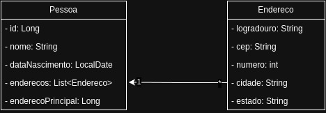

# Gerenciamento de pessoa API

Gerenciamento de pessoa API é um serviço REST para gerenciar pessoas e seus endereços. Este documento descreve as rotas
disponíveis, os dados esperados e as respostas fornecidas pela API.

## Diagrama de classes



## Como executar aplicação

1. Clone o repositório

```bash
git clone https://github.com/LuizVictor/gerenciamento-pessoas.git
```

2. Acesse o diretório da aplicação

```bash
cd gerenciamento-pessoas
```

3. Compile a aplicação

```bash
mvn clean install
```

4. Execute a aplicação

```bash
java -jar target/gerenciamento-pessoas-0.0.1-SNAPSHOT.jar
```

## Endpoints

### Salvar pessoa

- Endpoint: `POST /api/pessoas`
- Status: `201`
- Body

```json
{
  "nome": "John Doe",
  "dataNascimento": "1999-05-13"
}
```

### Buscar pessoas

- Endpoint: `GET /api/pessoas`
- Status: `200`
- Response

```json
[
  {
    "id": 1,
    "nome": "John Doe",
    "dataNascimento": "1999-05-13",
    "enderecos": [],
    "enderecoPrincipal": null
  }
]
```

### Buscar pessoa por id

- Endpoint: `GET /api/pessoas/{id}`
- Status: `200`
- Response

```json
{
  "id": 1,
  "nome": "John Doe",
  "dataNascimento": "1999-05-13",
  "enderecos": [],
  "enderecoPrincipal": null
}
```

### Editar pessoa

- Endpoint: `PUT /api/pessoas/{id}`
- Status: `200`
- Body

```json
{
  "nome": "Janet Doe",
  "dataNascimento": "2000-05-13"
}
```

### Adicionar endereço

- Endpoint: `PUT /api/pessoas/{id}/adicionar-endereco`
- Status: `200`
- Body

```json
{
  "logradouro": "Rua A",
  "cep": "44000-000",
  "numero": 10,
  "cidade": "Feira de Santana",
  "estado": "Bahia"
}
```

### Buscar endereços

- Endpoint: `GET /api/pessoas/{id}/enderecos`
- Status: `200`
- Response

```json
[
  {
    "id": 1,
    "logradouro": "Rua A",
    "cep": "44000-000",
    "numero": 10,
    "cidade": "Feira de Santana",
    "estado": "Bahia"
  }
]
```

### Editar endereço

- Endpoint: `PUT /api/pessoas/enderecos/{idEndereco}`
- Status: `200`
- Body

```json
  {
  "logradouro": "Rua B",
  "cep": "44000-000",
  "numero": 10,
  "cidade": "Feira de Santana",
  "estado": "Bahia"
}
```

### Adicionar endereço como principal

- Endpoint: `PUT /api/pessoas/{idPessoa}/adicionar-principal/{idEndereco}`
- Status: `204`